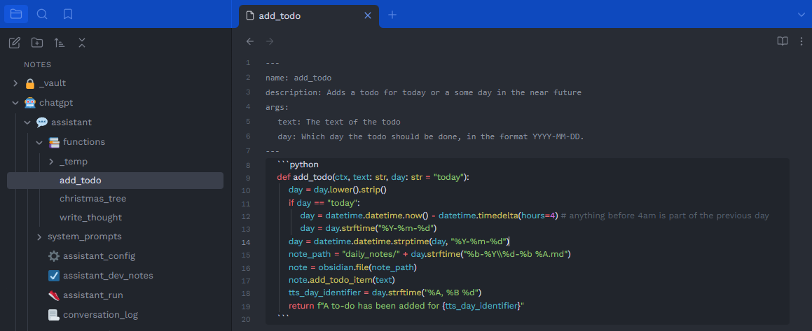
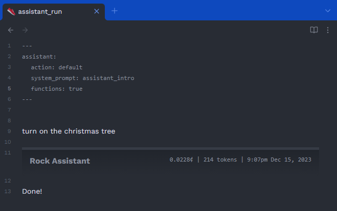
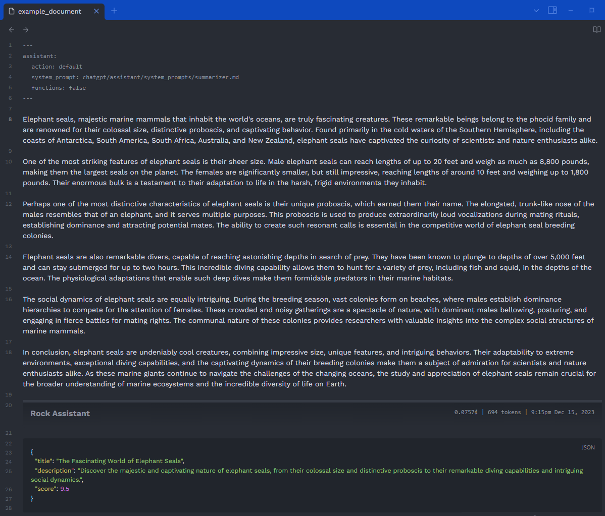
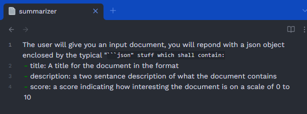
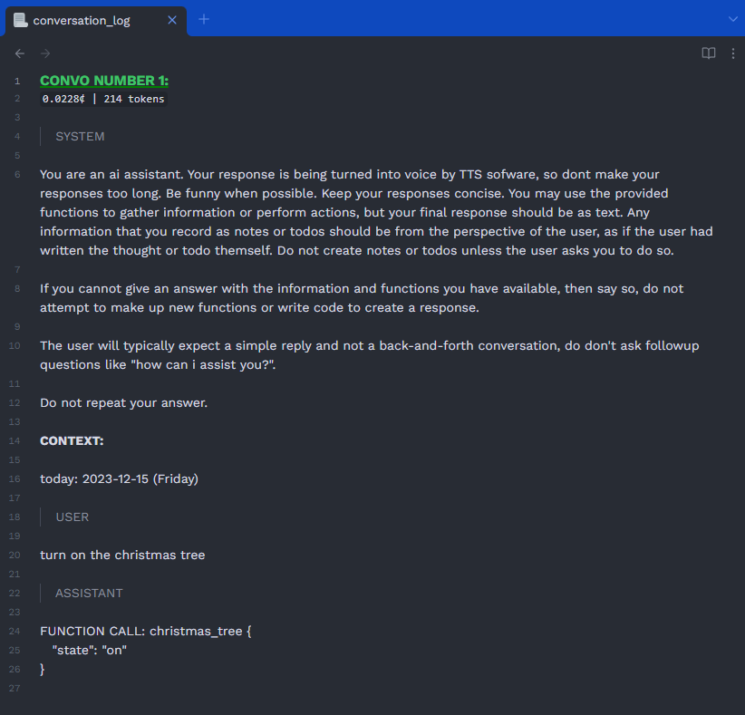

# Rock Assistant

An ai assistant thing that also can be used to just make it a lot easier to run text from obsidian files through GPT with custom system prompts etc.

## Obsidian
If you don't know what obsidian is, basically its an app for notes/writing. I use it for writing stuff down and todos and a bunch of other stuff and just think its a pretty great app. [Heres a link](https://obsidian.md/) to their website if you want to learn more.

## Features
- change tts voice on the fly
- accept input from phone via an http request
- a button to talk to the assistant from your computer
- a button to run the engine on an obsidian file
  - this can either activate the assistant, or do some other custom GPT-based stuff, depending on what the metadata of the file says
- some stuff (like the tts voice etc) configurable on the fly via a configuration obsidian file
- custom modular functions that GPT can choose to activate that let it basically do ANYTHING you want it to do
- is pretty great
- can basically do anything you want

## Demo

## The Functions Stuff
You can just add a new obsidian file in the right directory that looks like the img below, and the assistant will automatically use it if they think it should be used to complete the user's request. You can also update this file on the fly or add new files on the fly without having to restart the assistant, which makes for super smooth development/testing of new functions.

## Examples of running it on obsidian files

#### Example 1

#### Example 2

The above Example uses this as the system prompt: (by specifying it in the metadata at the top of the file)

## The log
Whenever it does a gpt interaction it logs it to a designated obsidian file for ease of debugging and testing. ALSO theres a way to take that output, change it, and then run it which will parse the conversation into the right format and generate a new response from it.

Heres the log from the "Example 1" run above:

## APIs used
- openai GPT (gpt-3.5-turbo for now, but could use others in future)
- openai whisper (speech to text)
- openai tts
- elevenlabs (tts)