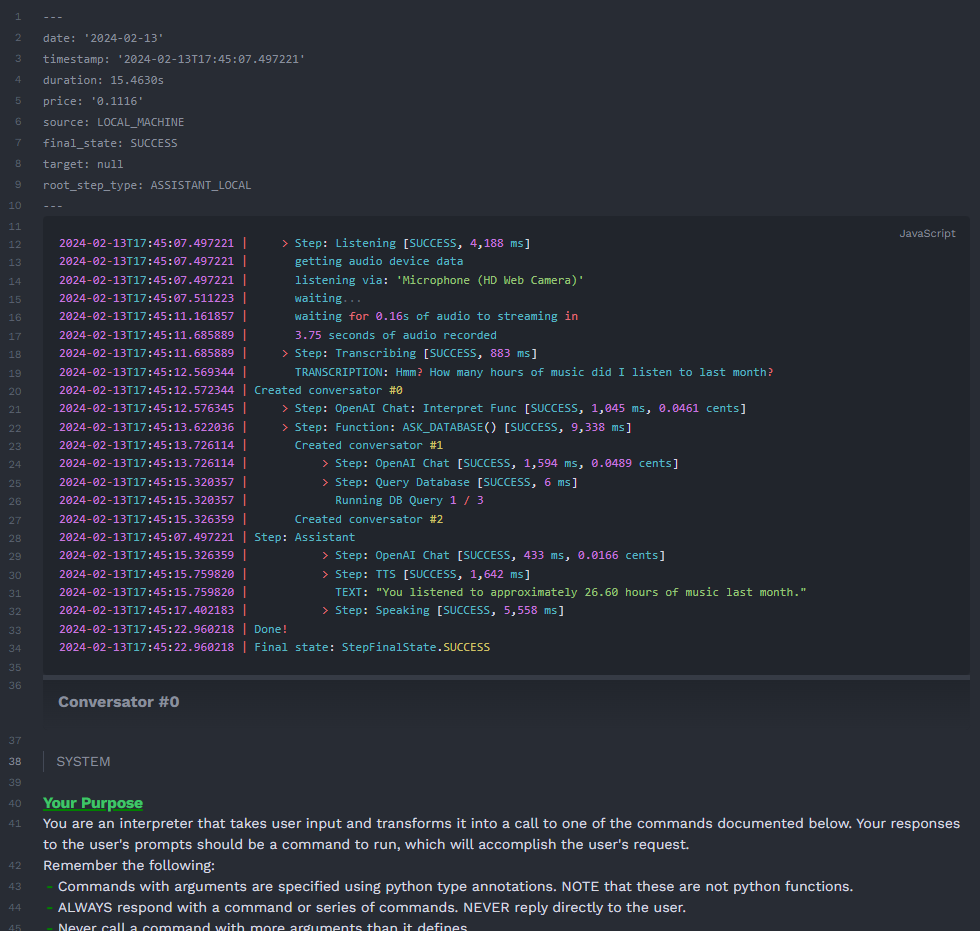

# Assistant


An ai assistant thing that also can be used to just make it a lot easier to run text from obsidian files through GPT with custom system prompts etc, and also has a coding assistant built in.

## Features
- custom modular functions that GPT can choose to activate that let it basically do ANYTHING you want it to do
- a button to talk to the assistant from your computer
- a button to run the engine on an obsidian file or code file
  - this can either activate the assistant, or do some other custom GPT-based stuff, depending on what the metadata of the file says
- accept input from phone via an http request
- is pretty great
- can basically do anything you want

## Demos

### Quick Demo
This is a quick and zoomed-in demo showing an example of the command that queries a local postgres database, by having the LLM interpret the user's request as an SQL query
<details>
  <summary>🎥 <b>Show Demo</b></summary>

https://github.com/mdiller/rock-assistant/assets/3231343/907154c0-f1c3-487e-99a6-310601d2e4e9

</details>

### Full Demo w/ GUI (v2)
A demo showcasing the gui, keyboard usage, obsidian runner, and coding assistant

(had to break this up into parts because its over 10MB. [Full demo here](docs/videos/demo2.mp4))
<details>
  <summary>🎥 <b>Show Demo</b></summary>

#### Part 1 (general assistant & thought recording)

https://github.com/mdiller/rock-assistant/assets/3231343/e11cf805-844f-4033-bc22-a7fd56bd4c03

#### Part 2 (obsidian runner)

https://github.com/mdiller/rock-assistant/assets/3231343/4671c279-7670-46f0-a956-86a7ed4690d4

#### Part 3 (coding assistant)

https://github.com/mdiller/rock-assistant/assets/3231343/a8fdb38e-d495-4e37-a566-42dd29a5952b

</details>

### Phone Demo (v1)
An earlier demo showcasing the basic system and accessing it from a phone.

<details>
  <summary>🎥 <b>Show Demo</b></summary>

https://github.com/mdiller/rock-assistant/assets/3231343/25e93dd3-7747-4fc9-907d-efdc9c6d0570

</details>

## Custom Functions

One of the core ideas of this assistant was to be able to create custom commands easily via python. Adding a function to any py file in `src/custom_funcs` will mean that automatically gets added to the list of functions the assistant will try to match the user's request against. You can see examples of that in [main_funcs.py](src/custom_funcs/main_funcs.py). 

### Defining functions via Obsidian [deprecated]

(I've switched away from this as it turns to to be a bit cumbersome to add and debug new commands)

~~You can just add a new obsidian file in the right directory that looks like the img below, and the assistant will automatically use it if they think it should be used to complete the user's request. You can also update this file on the fly or add new files on the fly without having to restart the assistant, which makes for super smooth development/testing of new functions.~~

<details>
  <summary>Old Implementation</summary>
  
</details>

## Obsidian
If you don't know what obsidian is, basically its an app for notes/writing. I use it for writing stuff down and todos and a bunch of other stuff and just think its a pretty great app. [Heres a link](https://obsidian.md/) to their website if you want to learn more.

## Examples of running it on obsidian files

#### Example 1


#### Example 2


The above Example uses this as the system prompt: (by specifying it in the metadata at the top of the file)


## The log
I've made a decently verbose logging system that records almost everything that goes on during an interaction to help debug stuff and cut down on how long it takes each step to complete. The log is in markdown and is designed to be viewed in my obsidian vault. It should display mostly ok in github markdown though. This is also a good place to look if you want to get a better understanding of how this system works. Heres an example log file from when I ask the database a question:

[Full Log File](docs/log_example.md)

Heres what the first part of a log looks like (its too big to fit in one screenshot):


## APIs used
- openai GPT (gpt-3.5-turbo for now, but could use others in future)
- openai whisper (speech to text)
- openai tts
- elevenlabs (tts)


## Batch script using for starting up my tray thing
```
@echo off
start /min "C:\Program Files\Python310\python.exe" "path\to\repo\src\main_wrapper.py"
```